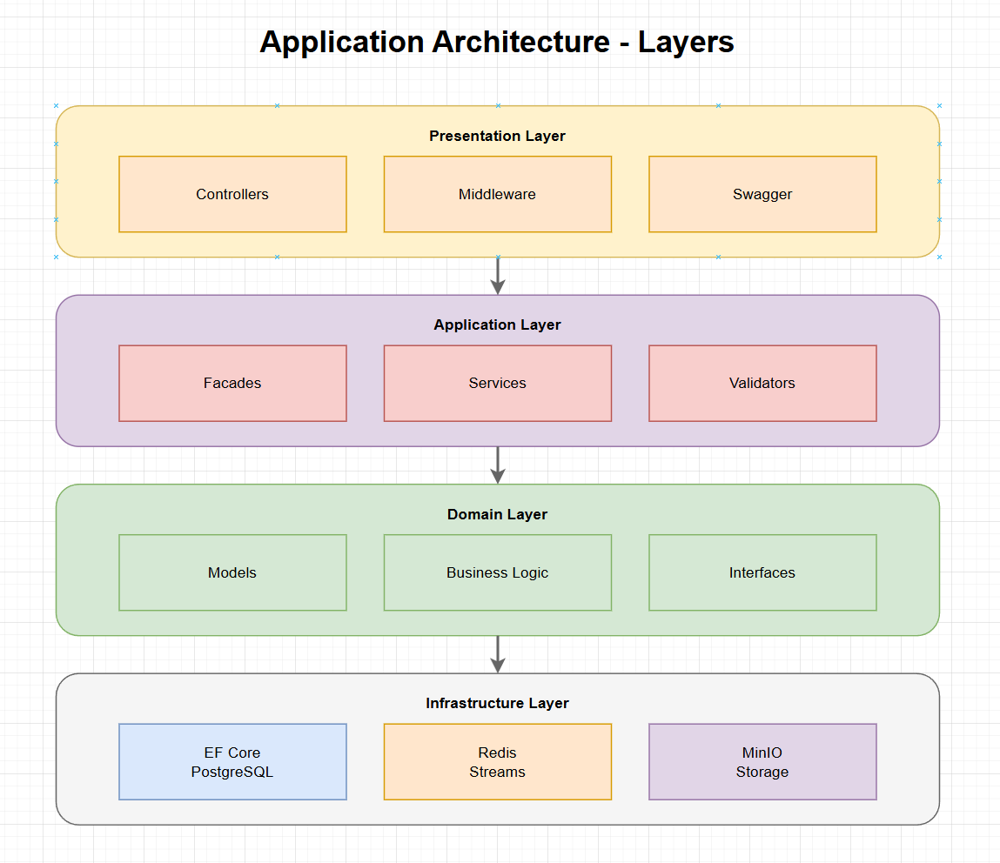
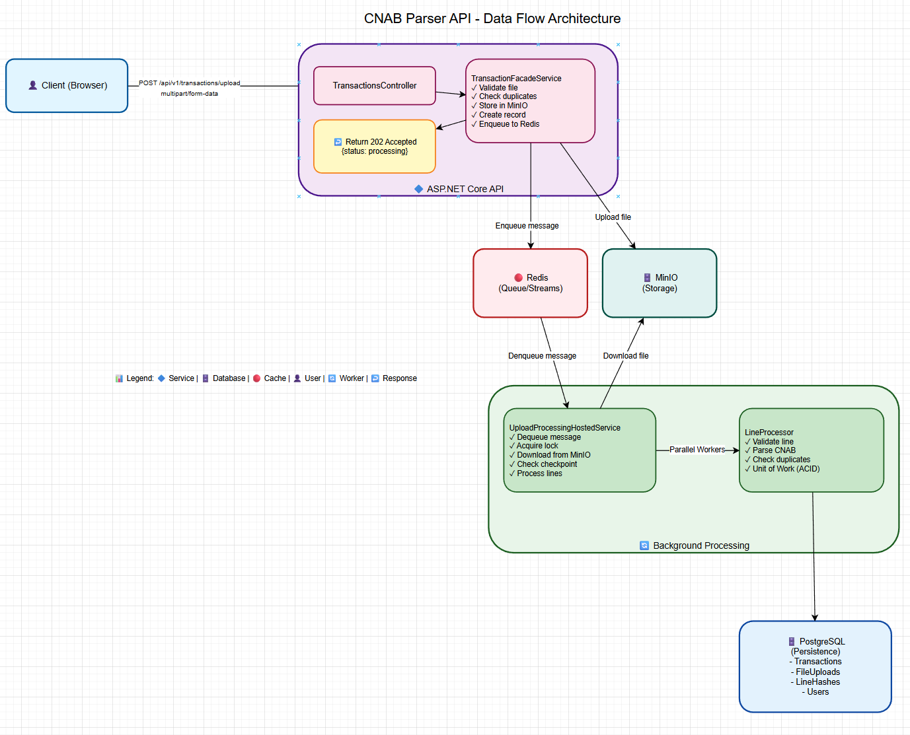
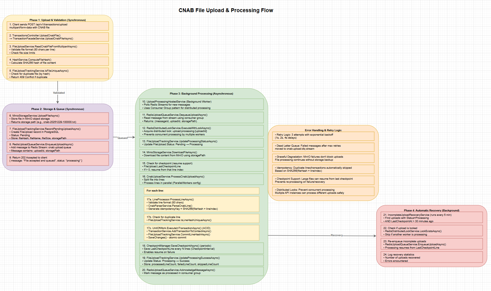

# 🏦 CNAB Parser API - Backend Challenge

[](https://github.com)
[](https://github.com)
[](https://github.com)
[](LICENSE)

A robust, production-ready API for processing and analyzing CNAB files with JWT authentication, GitHub OAuth, and enterprise-grade features like structured logging, robust validation, and comprehensive tests.


## 📋 Table of Contents

- [Overview](#overview)
- [Technologies](#technologies)
- [Prerequisites](#prerequisites)
- [Quick Start](#quick-start)
- [Detailed Configuration](#detailed-configuration)
- [API Usage](#api-usage)
- [Development](#development)
- [Tests](#tests)
- [Troubleshooting](#troubleshooting)
- [Documentation](#documentation)

## 🎯 Overview

**CNAB Parser API** is a complete solution for processing CNAB files (National Standardized Configuration for Banking Applications), providing:

✅ **CNAB file upload and parsing** with rigorous validation  
✅ **Versioned RESTful API** (`/api/v1/`) with JWT + GitHub OAuth authentication  
✅ **Pagination, filtering, and sorting** on transaction queries  
✅ **Structured logging** with end-to-end correlation ID (Serilog)  
✅ **Robust validation** with FluentValidation (real CPF, credentials)  
✅ **Comprehensive tests** (603 tests with 89.94% line coverage, 78.09% branch coverage, 93.67% method coverage)  
✅ **Docker Compose** for development and production  
✅ **Application Insights** ready for production telemetry  
✅ **ProblemDetails RFC 7807** for standardized HTTP responses  
✅ **Swagger/OpenAPI** with interactive documentation  
✅ **Prometheus & Grafana** monitoring with custom metrics and alerting  
✅ **Load testing** with NBomber for performance evaluation  

## 🛠️ Technologies

| Layer | Technology | Version | Purpose |
|--------|-----------|--------|----------|
| **Runtime** | .NET | 9.0/10.0 | Execution |
| **Web Framework** | ASP.NET Core | Latest | HTTP APIs |
| **Database** | PostgreSQL | 15 | Persistence |
| **Cache** | Redis | 7 | Caching/Sessions |
| **Object Storage** | MinIO | Latest | File Management |
| **ORM** | Entity Framework Core | Latest | Data Access |
| **Logging** | Serilog | 4.2.0 | Structured Logs |
| **Validation** | FluentValidation | 11.11.0 | Input Validation |
| **Errors** | ProblemDetails Middleware | 6.4.1 | RFC 7807 |
| **API Version** | Microsoft.AspNetCore.Mvc.Versioning | 5.1.0 | v1, v2... |
| **Testing** | xUnit + Moq | Latest | Tests |
| **Frontend** | React | 19 | UI |
| **Containers** | Docker | Latest | Orchestration |

## 🏗️ Architecture

### System Overview

The CNAB Parser API follows a **layered architecture** with clear separation of concerns:



### Key Components

#### **Controllers** (`backend/Controllers/`)
- `TransactionsController`: Handles CNAB file uploads and transaction queries
- `AuthController`: Manages JWT authentication and GitHub OAuth

#### **Services** (`backend/Services/`)
- **Facades**: `TransactionFacadeService` - Orchestrates business operations
- **Upload Processing**: 
  - `CnabUploadService` - Processes CNAB files line by line
  - `UploadProcessingHostedService` - Background worker consuming from Redis queue
  - `IncompleteUploadRecoveryService` - Auto-recovers stuck uploads
- **Parsing**: `CnabParserService` - Parses CNAB line format (80 chars)
- **Storage**: 
  - `MinioStorageService` - Object storage for file persistence
  - `FileUploadTrackingService` - Tracks upload status and duplicates
- **Queue**: `RedisUploadQueueService` - Redis Streams for reliable message queue
- **Locking**: `RedisDistributedLockService` - Distributed locks for concurrent processing
- **Line Processing**: 
  - `LineProcessor` - Processes individual CNAB lines
  - `CheckpointManager` - Manages resume points for large files

#### **Data Layer** (`backend/Data/`)
- `CnabDbContext`: EF Core DbContext with PostgreSQL
- **Migrations**: Automatic schema management
- **Models**: `Transaction`, `FileUpload`, `FileUploadLineHash`, `User`, `RefreshToken`

#### **Background Services** (`backend/Services/Hosted/`)
- `UploadProcessingHostedService`: Processes uploads from Redis queue
- `IncompleteUploadRecoveryService`: Recovers incomplete uploads automatically

### 🎨 Visual Architecture Diagrams

The system architecture is documented with interactive diagrams in [processing-flow.drawio](processing-flow.drawio):

1. **Data Flow Architecture** - Simplified overview of how data flows through the system:
   - Client (Browser) → ASP.NET Core API → MinIO & Redis → Background Processing → PostgreSQL
   - Shows synchronous and asynchronous phases
   - Open in [app.diagrams.net](https://app.diagrams.net) for interactive viewing



2. **Detailed Processing Flow** - Complete 4-phase flow with all operations:
   - Phase 1: Upload & Validation (Synchronous)
   - Phase 2: Storage & Queue (Synchronous)
   - Phase 3: Background Processing (Asynchronous with parallel workers)
   - Phase 4: Automatic Recovery (Background service)



To view the diagrams:
```bash
# Option 1: Open in draw.io online
# Visit https://app.diagrams.net and open "processing-flow.drawio"

# Option 2: View in VS Code (with draw.io extension)
# Open "processing-flow.drawio" directly
```

### Key Features

#### **Idempotency & Duplicate Prevention**
- **File-level**: SHA256 hash of entire file content (unique constraint)
- **Line-level**: SHA256(fileHash + lineIndex) stored in `FileUploadLineHashes`
- **Transaction-level**: `IdempotencyKey` column prevents duplicate transactions
- **Retry-safe**: Failed batches can be reprocessed without creating duplicates

#### **Checkpoint & Resume Support**
- Checkpoints saved periodically during processing
- `LastCheckpointLine` tracks progress
- Automatic resume from last checkpoint on recovery
- Supports processing of very large files (>100k lines)

#### **Distributed Processing**
- **Redis Streams**: Reliable message queue with consumer groups
- **Distributed Locks**: Prevents concurrent processing of same upload
- **Parallel Workers**: Configurable number of parallel line processors
- **Horizontal Scaling**: Multiple API instances can process uploads concurrently

#### **Error Handling & Resilience**
- **Retry Logic**: Exponential backoff (3 retries with 1s, 2s, 4s delays)
- **Dead Letter Queue**: Failed messages moved to DLQ after max retries
- **Graceful Degradation**: MinIO failures don't block uploads
- **Automatic Recovery**: Incomplete uploads automatically re-enqueued

### Processing Flow

For a detailed step-by-step breakdown of the upload and processing flow, see the interactive diagrams in [processing-flow.drawio](processing-flow.drawio):

- **Upload Phase**: File validation, hashing, duplicate checking
- **Storage Phase**: MinIO storage, database record creation, Redis queue enqueuing
- **Background Processing Phase**: Queue consumption, parallel line processing, checkpoint management
- **Recovery Phase**: Automatic detection and re-processing of stuck uploads

Each step includes:
- Specific service/method calls
- Database operations (ACID transactions)
- Error handling and retry logic
- Idempotency checks

### Technology Stack Details

- **REST API**: [backend/Program.cs](backend/Program.cs) with controllers in [backend/Controllers](backend/Controllers)
- **Domain/Services Layer**: Parser, upload, transactions, and files in [backend/Services](backend/Services)
- **Persistence**: EF Core + migrations in [backend/Data](backend/Data)
- **Middleware**: Global error handling (ExceptionHandlingMiddleware), correlation ID tracking
- **Background Processing**: Hosted services for queue consumption and recovery

## Prerequisites

**Minimum (recommended):**
- Docker Desktop ([Download](https://www.docker.com/products/docker-desktop))

**Optional (local development):**
- .NET 9 SDK
- Node 20+
- PostgreSQL 16 (required for local development without Docker)

**Note on Database Selection:**
The challenge requires using PostgreSQL, MySQL, or SQL Server. This project uses **PostgreSQL 15/16** as the database solution, which fully satisfies the requirement. The application is designed to work with PostgreSQL and uses EF Core with Npgsql provider for optimal performance and PostgreSQL-specific features.

## Running with Docker (recommended)

### Option 1 - Automated Setup (recommended)

```bash
# Windows
setup.bat

# macOS / Linux / WSL
bash setup.sh
```

The script automatically:
1. ✅ Checks if Docker is installed and running
2. ✅ Creates `.env` file (if it doesn't exist)
3. ✅ Builds containers
4. ✅ Brings up all services
5. ✅ Waits for them to be healthy (30s)

### Option 2 - Manual Command

```bash
docker-compose up --build
```

### Available Services

| Service | URL | Description |
|---------|-----|-----------|
| **Frontend** | http://localhost:3000 | CNAB upload interface |
| **API** | http://localhost:5000 | Backend REST API |
| **Swagger** | http://localhost:5000/swagger | Interactive documentation |
| **Database** | localhost:5432 | PostgreSQL (postgres/postgres) |
| **MinIO Storage** | http://localhost:9000 | Object storage (API) |
| **MinIO Console** | http://localhost:9001 | Management UI |
| **Health Check** | http://localhost:5000/api/v1/health | Application status |
| **Prometheus Metrics** | http://localhost:5000/metrics | Metrics for Prometheus/Grafana |
| **Prometheus** | http://localhost:9090 | Metrics collection and querying |
| **Grafana** | http://localhost:3001 | Monitoring dashboards |

### Application Health and Monitoring

```bash
# Simple health check (returns "Healthy")
curl http://localhost:5000/api/v1/health

# Prometheus metrics (for scraping)
curl http://localhost:5000/metrics

# Readiness probe (k8s)
curl http://localhost:5000/api/v1/health/ready

# Liveness probe (k8s)
curl http://localhost:5000/api/v1/health/live
```

### Useful Commands

```bash
# Check service status
docker-compose ps

# View logs in real-time
docker-compose logs -f api              # API logs
docker-compose logs -f frontend         # Frontend logs
docker-compose logs -f                  # All logs

# Stop services
docker-compose down

# Restart everything
docker-compose down && docker-compose up -d --build

# Clean volumes (recreates database)
docker-compose down -v
```

## Running Only the API (without Docker)

### Backend

Prerequisites: .NET 9 SDK + PostgreSQL 16

```bash
# 1. Install dependencies
cd backend
dotnet restore

# 2. Configure database (optional)
$env:ConnectionStrings__PostgresConnection = "Host=localhost;Port=5432;Database=cnab_db;Username=postgres;Password=postgres"

# 3. Apply migrations
dotnet ef database update

# 4. Run API
dotnet run
```

API runs at: http://localhost:5000

### Frontend

Prerequisites: Node.js 20+

```bash
cd frontend
npm install
npm start
```

Frontend runs at: http://localhost:3000

## Load Testing

### Quick Start (Zero Configuration!)

Load tests are implemented using [NBomber](https://nbomber.com/) to evaluate API performance under different load conditions.

```bash
# Navigate to load tests directory
cd backend.LoadTests

# Run load tests (first time may need to restore packages)
dotnet run
```

**That's it!** The script automatically:
- ✅ Checks if API is accessible
- ✅ Creates test user if needed (no manual setup!)
- ✅ Runs all test scenarios

**No configuration needed!** Uses default credentials that are created automatically.

### Test Scenarios

- **Health Check**: 10 req/s for 30 seconds
- **Get Uploads**: 5 req/s for 60 seconds
- **Get Transactions**: 5 req/s for 60 seconds
- **Upload CNAB File**: 1 req/s for 120 seconds

### Monitoring During Tests

**Real-time monitoring with Grafana:**
1. Open http://localhost:3001 before starting tests
2. Go to "CNAB API - Overview" dashboard
3. Watch metrics update in real-time:
   - Request rate increases during tests
   - Response time (p95) shows latency
   - Error rate should stay low

**Or use Prometheus:**
- Open http://localhost:9090
- Run queries: `rate(http_requests_received_total[1m])`

### Understanding Results

**Key metrics:**
- **p95 Response Time**: 95% of requests are faster (most important!)
- **Success Rate**: Should be > 99%
- **RPS**: Should match configured rate

**Good performance:**
- p95 < 100ms: Excellent
- p95 < 500ms: Good
- p95 > 1000ms: Needs investigation

### Configuration

Edit `backend.LoadTests/appsettings.json` to configure:
- API base URL
- Test user credentials
- Load test parameters

### Documentation

- **Quick Guide**: [backend.LoadTests/HOW_TO_RUN.md](backend.LoadTests/HOW_TO_RUN.md) - Complete step-by-step guide
- **README**: [backend.LoadTests/README.md](backend.LoadTests/README.md) - Overview and reference

## Monitoring with Prometheus & Grafana

### Quick Start

```bash
# Start all services including Prometheus and Grafana
docker-compose up -d

# Access Grafana
# URL: http://localhost:3001
# Default credentials: admin/admin (change in production!)
```

**Available Dashboards:**
- **CNAB API - Overview**: HTTP metrics, response times, status codes
- **CNAB API - Detailed Metrics**: Endpoint-level metrics, database connections
- **CNAB API - Complete Monitoring**: Comprehensive monitoring view
- **CNAB API - With Filters**: Interactive dashboards with filters for endpoints, status codes, upload status, and error types

**Prometheus:**
- URL: http://localhost:9090
- Scrapes metrics from API every 15 seconds
- Alert rules configured for error rates, response times, queue backlogs, and service health
- See [monitoring/prometheus/queries.md](monitoring/prometheus/queries.md) for useful queries with filters

**Custom Metrics:**
- File upload metrics (rate, size, duration, status)
- Transaction processing metrics (rate, type, status)
- Queue metrics (size, operations)
- Processing error metrics (type, component)
- API operation metrics (endpoint, method, status)

For detailed setup instructions, see [monitoring/README.md](monitoring/README.md).

## Tests

### Running Tests

```bash
# All tests
dotnet test

# Unit tests only
dotnet test backend.Tests/CnabApi.Tests.csproj

# Integration tests only
dotnet test backend.IntegrationTests/CnabApi.IntegrationTests.csproj

# With coverage report
dotnet test backend.Tests/CnabApi.Tests.csproj /p:CollectCoverage=true /p:CoverletOutputFormat=cobertura
```

### Test Quality

The test suite has been optimized for maintainability and coverage:

**Improvements Made:**
- ✅ **Consolidated duplicate tests**: Multiple `[Fact]` tests with similar logic merged into `[Theory]` tests with `[InlineData]`
- ✅ **Removed non-executable tests**: Tests marked as `Skip` that cannot run in unit test environment were removed
- ✅ **Added missing coverage**: Created tests for previously untested methods in:
  - `HashService` (ComputeFileHash, ComputeLineHash, ComputeStreamHashAsync)
  - `FileUploadTrackingService` (CommitLineHashesAsync, FindIncompleteUploadsAsync, UpdateProcessingResultAsync)
  - `TransactionService` (AddSingleTransactionAsync, AddTransactionToContextAsync)
  - `CnabParserService` (ParseCnabLine with various scenarios)
  - `EfCoreUnitOfWork` (transaction management methods)
  - `FileServiceExtensions` (validation methods)
  - `LineProcessor` (processing scenarios)
  - `CheckpointManager` (checkpoint logic)
  - `UploadStatusCodeStrategyFactory` (status code determination)

**Test Organization:**
- Tests are organized by service/component
- Similar test cases use `[Theory]` with `[InlineData]` to reduce duplication
- Clear test names following the pattern: `MethodName_Scenario_ExpectedBehavior`

### Code Coverage

The project has **89.94% line coverage**, **78.09% branch coverage**, and **93.67% method coverage** (603 tests).

**Current Test Status:**
- ✅ **603 tests passing**
- ✅ **0 tests failing**
- ✅ **0 tests skipped**
- ✅ **All tests consolidated** - Duplicate tests merged into `[Theory]` tests with `[InlineData]`

#### Generate Coverage Report

```bash
# 1. Run tests with coverage (generates coverage.cobertura.xml)
dotnet test backend.Tests/CnabApi.Tests.csproj /p:CollectCoverage=true /p:CoverletOutputFormat=cobertura

# 2. Generate HTML report (requires reportgenerator)
reportgenerator -reports:backend.Tests/coverage.cobertura.xml -targetdir:backend.Tests/TestResults/CoverageReport -reporttypes:Html

# 3. Open report in browser
# Windows
start backend.Tests/TestResults/CoverageReport/index.html
# macOS
open backend.Tests/TestResults/CoverageReport/index.html
# Linux
xdg-open backend.Tests/TestResults/CoverageReport/index.html
```

#### Install ReportGenerator (first time)

```bash
dotnet tool install -g dotnet-reportgenerator-globaltool
```

#### What's Excluded from Coverage

Infrastructure code marked with `[ExcludeFromCodeCoverage]`:
- ✅ EF Core migrations
- ✅ Program.cs (startup configuration)
- ✅ Configuration extensions (ServiceCollection, Middleware, HealthChecks)
- ✅ DataSeeder
- ✅ Exception handling middleware
- ✅ Redis services (RedisDistributedLockService, RedisUploadQueueService) - requires Redis integration tests
- ✅ MinIO services (MinioInitializationService, MinioStorageService, MinioStorageConfiguration) - requires MinIO integration tests
- ✅ Testing infrastructure (MockDistributedLockService, MockUploadQueueService) - not part of business logic

This ensures coverage reflects only **testable business code**. Infrastructure components that require external services (Redis, MinIO) are excluded and should be tested with integration tests.

## 📡 Main Endpoints

### File Upload & Management
- `POST /api/v1/transactions/upload` — Upload CNAB file for processing (returns 202 Accepted for async)
- `GET /api/v1/transactions/uploads` — List all file uploads with pagination and optional status filter
- `GET /api/v1/transactions/uploads/{uploadId}` — Get detailed information about a specific upload
- `GET /api/v1/transactions/uploads/incomplete` — List uploads stuck in Processing status (incomplete)
- `POST /api/v1/transactions/uploads/{uploadId}/resume` — Resume processing of a specific incomplete upload
- `POST /api/v1/transactions/uploads/resume-all` — Resume processing of all incomplete uploads

### Transaction Queries
- `GET /api/v1/transactions/stores/{uploadId}` — Get transactions grouped by store with pagination and balance calculation

### Admin Operations
- `DELETE /api/v1/transactions` — Clear all transactions and uploads (Admin only)

### Authentication
- `POST /api/v1/auth/register` — Register new user
- `POST /api/v1/auth/login` — Login with username/password
- `POST /api/v1/auth/refresh` — Refresh JWT token
- `GET /api/v1/auth/me` — Get authenticated user profile
- `POST /api/v1/auth/logout` — Logout and invalidate refresh token
- `GET /api/v1/auth/github/login` — GitHub OAuth login redirect

### Health & Monitoring
- `GET /api/v1/health` — Check application health status
- `GET /api/v1/health/ready` — Kubernetes readiness probe
- `GET /api/v1/health/live` — Kubernetes liveness probe
- `GET /metrics` — Prometheus metrics for monitoring

**Full API Documentation**: [API_DOCUMENTATION.md](API_DOCUMENTATION.md) | **Interactive Docs**: Swagger at `/swagger`

### Upload Processing Modes

The API supports two processing strategies (configurable via environment):

1. **Asynchronous Processing (Production)**:
   - File is validated and stored immediately
   - Returns `202 Accepted` with upload ID
   - Processing happens in background via Redis queue
   - Monitor progress via `GET /api/v1/transactions/uploads/{uploadId}`
   - **Environment**: All environments except `Test`

2. **Synchronous Processing (Test Environment Only)**:
   - File is processed immediately during the request
   - Returns `200 OK` with transaction count
   - No Redis queue required
   - **Environment**: Only when `ASPNETCORE_ENVIRONMENT=Test`
   - **Use case**: Unit and integration tests requiring immediate results

## Environment Variables

The `.env` file controls configuration:

```bash
POSTGRES_USER=postgres              # Database user
POSTGRES_PASSWORD=postgres          # Database password
API_PORT=5000                       # API port
FRONTEND_PORT=3000                  # Frontend port
ASPNETCORE_ENVIRONMENT=Production   # Mode (Production/Development)
MINIO_ROOT_USER=cnabuser            # MinIO access key
MINIO_ROOT_PASSWORD=cnabpass123     # MinIO secret key
```

To customize, edit `.env` and restart:

```bash
docker-compose down
docker-compose up -d --build
```

### MinIO Configuration

MinIO is configured as the object storage service for file uploads and management:

```bash
# Access MinIO Console (Web UI)
http://localhost:9001

# Credentials (from .env)
Username: cnabuser
Password: cnabpass123

# API Endpoint (used by backend)
http://minio:9000  # Inside Docker
http://localhost:9000  # Local access
```

**Features**:
- ✅ Async initialization with graceful degradation
- ✅ Automatic bucket creation on startup
- ✅ File upload/download/delete operations
- ✅ Integrated error handling and logging
- ✅ Production-ready configuration

**Using MinIO for file storage**:
```csharp
// The TransactionFacadeService automatically stores uploaded CNAB files in MinIO
// after successful processing
await _objectStorageService.UploadFileAsync(bucketName, fileName, stream);
```

## Troubleshooting

### "Docker is not installed"
- Install [Docker Desktop](https://www.docker.com/products/docker-desktop)
- Restart your computer
- Run setup again

### "Docker daemon is not running"
- Open Docker Desktop
- Wait until it's ready
- Run setup again

### "Port 5000 is already in use"
```bash
API_PORT=5001              # Edit .env
docker-compose down && docker-compose up -d --build
```

### "Frontend cannot connect to API"
```bash
docker-compose logs api    # Check logs
```
- Clear browser cache (Ctrl+Shift+Delete)
- Check if API is running at http://localhost:5000/swagger

### "Database won't start"
```bash
docker-compose down -v     # Remove volumes
docker-compose up -d --build
```

### View detailed logs
```bash
docker-compose logs postgres              # Full log
docker-compose logs postgres --tail=50    # Last 50 lines
```

## Helpful Tips

- **First run**: may take 5-10 minutes for downloads and build
- **Before git pull**: always run `docker-compose down`
- **For troubleshooting**: use `docker-compose logs -f` to see logs in real-time
- **Containers restart automatically** (`restart: unless-stopped`)

## Project Structure

```
backend-challenge/
├── backend/                    # ASP.NET Core 9 API
│   ├── Controllers/            # REST endpoints
│   ├── Services/               # Business logic
│   ├── Models/                 # DTOs and entities
│   ├── Data/                   # EF Core + migrations
│   └── Dockerfile              # Production build
│
├── backend.Tests/              # Unit tests (xUnit)
│   ├── Services/               # Service tests
│   ├── Controllers/            # Controller tests
│   └── Utilities/              # Utility tests
│
├── backend.IntegrationTests/   # Integration tests
│
├── frontend/                   # React app
│   ├── public/                 # Static HTML
│   ├── src/                    # Components
│   └── Dockerfile              # Production build
│
├── docker-compose.yml          # Orchestration
├── .env.example                # Variables template
├── setup.bat                   # Windows setup
├── setup.sh                    # Unix setup
│
├── README.md                   # This file
├── API_DOCUMENTATION.md        # Endpoint reference
└── ROADMAP.md                  # Development plan
```

**Total tests**: 603 (xUnit + Moq)  
**Coverage**: 89.94% line, 78.09% branch, 93.67% method

**Test Quality Improvements:**
- ✅ Consolidated duplicate tests into `[Theory]` tests with `[InlineData]` for better maintainability
- ✅ Removed tests that cannot be executed (marked as Skip)
- ✅ Added comprehensive tests for previously uncovered methods
- ✅ All tests passing with zero failures

## 📚 Documentation

- [API_DOCUMENTATION.md](API_DOCUMENTATION.md) - Complete API reference with curl/Postman examples

## 🏗️ Architecture

- **Backend**: ASP.NET Core 9 + EF Core 9 + PostgreSQL 16
- **Frontend**: React 19 + Axios
- **Database**: PostgreSQL with automatic migrations
- **Cache**: Redis for performance
- **Testing**: xUnit + Moq + WebApplicationFactory
- **Deploy**: Docker Compose with health checks

## 🗄️ Database Performance & Tuning

### Indexes
The following indexes are automatically created via EF Core migrations to optimize query performance:

| Index | Table | Columns | Purpose |
|-------|-------|---------|---------|
| `IX_Transactions_Cpf` | Transactions | Cpf | Index for CPF field (part of transaction data) |
| `IX_Transactions_NatureCode` | Transactions | NatureCode | Filter by transaction type |
| `IX_RefreshTokens_UserId` | RefreshTokens | UserId | JWT refresh token lookups |
| `IX_RefreshTokens_Token` | RefreshTokens | Token | Token validation |

**Migration Reference**: [20251219190000_AddTransactionIndexes.cs](backend/Data/Migrations/20251219190000_AddTransactionIndexes.cs)

### Idempotency Strategy
- **Hash-based keys**: `SHA256(file_content + line_index)` prevents duplicate imports
- **Database constraint**: Unique index on `IdempotencyKey` column
- **Retry-safe**: Failed batches can be reprocessed without duplicates

**Migration Reference**: [20251222162817_AddIdempotencyKey.cs](backend/Data/Migrations/20251222162817_AddIdempotencyKey.cs)

### Resilience & Retry Policies
Polly-based retry policies with exponential backoff for transient failures:

- **Database operations**: 3 retries (2s, 4s, 8s delays)
- **File operations**: 3 retries (500ms, 1s, 2s delays)
- **HTTP clients**: Circuit breaker + jitter

**Implementation**: [ResiliencePolicies.cs](backend/Services/Resilience/ResiliencePolicies.cs)

### Performance Optimizations
- ✅ **Streaming upload**: MultipartReader prevents memory overflow on large files
- ✅ **Batch processing**: EF Core `AddRange()` + single `SaveChanges()`
- ✅ **Connection pooling**: Default ADO.NET pool (min=0, max=100)
- ✅ **Query optimization**: Includes/projections to avoid N+1
- ✅ **Pagination**: Offset-based (page-based) pagination for transaction queries

### Pagination Strategy

The API uses **offset-based pagination** (page-based) instead of cursor-based pagination for transaction queries. This choice is based on the following technical considerations:

**1. Bidirectional Navigation**
- Enables direct navigation both forward (Next) and backward (Previous) without requiring client-side state management
- Frontend can easily calculate previous pages using `page - 1`
- Supports direct page jumps (e.g., "go to page 3")

**2. Total Count Availability**
- Provides `totalCount` and `totalPages` metadata, enabling UI features like:
  - "Page 2 of 5" indicators
  - Progress bars showing pagination status
  - Direct page number selection

**3. Data Consistency**
- For the store-grouped transaction use case, data is relatively stable after CNAB file processing
- Offset-based pagination provides a consistent snapshot of data at query time
- Minimal risk of duplicate or missing items during navigation for this use case

**4. Use Case Alignment**
- Transactions are grouped by store name from already-processed files
- Data doesn't change frequently during viewing sessions
- Cursor-based pagination is more suitable for:
  - Extremely large datasets (millions+ records)
  - Frequently changing data (real-time feeds)
  - Scenarios where data consistency during pagination is critical

**5. Frontend Simplicity**
- Traditional pagination controls (Previous/Next buttons, page selectors) can be implemented without cursor token management
- No need for additional client-side state to track cursors
- Easier to implement and maintain

**6. Stable Ordering**
- Results are ordered by `StoreName`, which provides stable and predictable ordering
- The same page number always returns the same results (assuming data hasn't changed)
- Ensures consistent user experience across page navigation

**When Cursor-Based Would Be Preferred:**
- Real-time data feeds with high mutation rates
- Datasets with millions of records where offset becomes inefficient
- Scenarios requiring guaranteed consistency during pagination (no duplicates/skips)

## License

Internal use for the technical challenge.
